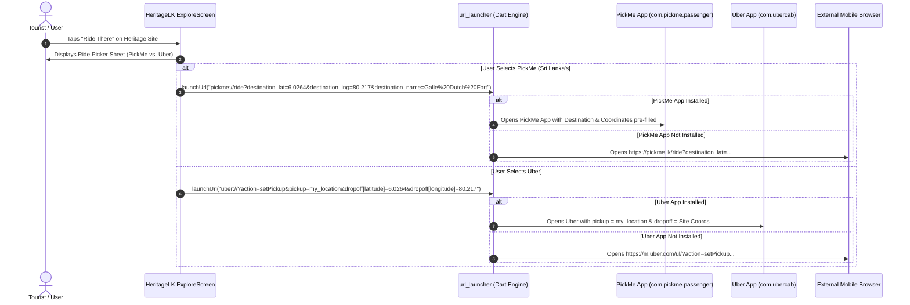

# HeritageLK Hackathon System Architecture & Deep Link Integration

> **Hackathon Presentation Architecture & Integration Blueprint**  
> **Project:** HeritageLK (Sri Lankan Smart Cultural Tourism & Preservation Platform)  
> **Target Audience:** Hackathon Judging Panel / Pitch Presentation  
> **Key Innovations:** Multimodal AI Vision, GIS Spatial Heatmaps, Real-Time PickMe & Uber App-to-App Deep Linking, Community Conservation Engine.

---

## 1. Hackathon Pitch Infographic & Architecture Visual

An infographic diagram visualizing the high-level architecture:


---

## 2. Comprehensive System Architecture Diagram (Judge Board View)

```mermaid
flowchart TD
    subgraph CLIENT["Client Tier (Flutter Cross-Platform App)"]
        UI_Home["MainHomeScreen"]
        UI_Explore["ExploreScreen (GIS Map)"]
        UI_Scanner["ScannerScreen (Camera Vision)"]
        UI_Shingo["ShingoScreen (AI Chat Companion)"]
        UI_Passport["PassportScreen & Digital Garden"]
        UI_Admin["ReportAdminScreen & Web Admin Portal"]
    end

    subgraph DEEPLINKS["Transport & External App Integration Tier"]
        DL_PickMe["PickMe Deep Link Handler<br>pickme://ride?destination_lat=&destination_lng="]
        DL_Uber["Uber Deep Link Handler<br>uber://?action=setPickup&dropoff[lat]="]
        DL_WebFallback["HTTP Web Fallbacks<br>https://pickme.lk/ride | https://m.uber.com"]
    end

    subgraph AI_ENGINE["Intelligence Tier (Google Gemini AI Engine)"]
        Gemini_Vision["Gemini 1.5 Flash Vision Model<br>(Monument & Inscription Identification)"]
        Gemini_Chat["Gemini Generative Chat Agent<br>(Contextual Sri Lankan Folklore & History)"]
        Gemini_Archive["AI Archive Synthesizer<br>(Automated Metadata & Article Generation)"]
        Key_Failover["Dynamic Key Resilience Chain<br>User Key ➔ Env Key ➔ Primary ➔ Backup Key"]
    end

    subgraph BAAS["Backend Tier (Supabase BaaS Engine)"]
        Supa_Auth["Supabase Auth & OAuth<br>(Email/Password, Magic Link, Google SSO)"]
        Supa_DB[(Supabase PostgreSQL RLS Database)]
        Supa_Storage[(Supabase Object Storage Buckets<br>archive-photos | damage-reports | profile-avatars)]
        Supa_Realtime["Supabase Realtime Engine<br>(Live Community Feed & Moderation)"]
    end

    subgraph GIS_SERVICES["Geospatial & Content Services"]
        OSM_Tiles["CartoDB Dark / OpenStreetMap Tile Server"]
        Map_Cache["Offline Map Tile Cache Engine (IO/Web)"]
        Wiki_API["Wikipedia Open REST API Integration"]
    end

    %% Flow Connections
    CLIENT --> DEEPLINKS
    DEEPLINKS --> DL_PickMe
    DEEPLINKS --> DL_Uber
    DEEPLINKS --> DL_WebFallback

    UI_Scanner --> Gemini_Vision
    UI_Shingo --> Gemini_Chat
    AI_ENGINE --> Key_Failover

    UI_Explore --> OSM_Tiles
    UI_Explore --> Map_Cache
    UI_Explore --> Wiki_API

    CLIENT --> Supa_Auth
    CLIENT --> Supa_DB
    CLIENT --> Supa_Storage
    CLIENT --> Supa_Realtime
```

---

## 3. Deep Dive: "Ride There" Mobility Deep-Linking Subsystem

One of HeritageLK's killer hackathon features for tourists and explorers is **"Ride There" Direct Mobility Dispatch**. 

When a user taps **"Ride There"** on any heritage site (e.g., Sigiriya, Galle Dutch Fort, or Ruwanwelisaya) in [explore_screen.dart](file:///C:/Users/Dell/Downloads/HeritageLKK/lib/screens/explore_screen.dart#L620-L650), HeritageLK bypasses generic maps and executes direct app-to-app deep links to local Sri Lankan ride-hailing platforms (**PickMe**) and global services (**Uber**).



### 3.1 PickMe Native Deep Link Schema
PickMe is the primary ride-hailing platform in Sri Lanka. The deep link specification implemented in HeritageLK handles Android intent schemes as well as native iOS URI schemes:

```dart
// Native App Scheme:
pickme://ride?destination_lat={latitude}&destination_lng={longitude}&destination_name={site_name}

// Android Intent Scheme:
intent://ride?destination_lat={lat}&destination_lng={lon}&destination_name={name}#Intent;scheme=pickme;package=com.pickme.passenger;end;

// Web Fallback (opens PickMe online dispatcher):
https://pickme.lk/ride?destination_lat={lat}&destination_lng={lon}&destination_name={name}
```

### 3.2 Uber Native Deep Link Schema
For international travelers using Uber in Sri Lanka:

```dart
// Native App Scheme:
uber://?action=setPickup&pickup=my_location&dropoff[latitude]={latitude}&dropoff[longitude]={longitude}&dropoff[nickname]={site_name}

// Web Fallback:
https://m.uber.com/ul/?action=setPickup&pickup=my_location&dropoff[latitude]={lat}&dropoff[longitude]={lon}&dropoff[nickname]={name}
```

---

## 4. Key Hackathon Pitch Points for Judges

| Feature Subsystem | Technical Implementation | Hackathon Value Proposition |
| :--- | :--- | :--- |
| **Mobility Integration ("Ride There")** | Native PickMe & Uber URI deep links with graceful web fallbacks in [explore_screen.dart](file:///C:/Users/Dell/Downloads/HeritageLKK/lib/screens/explore_screen.dart#L620-L650) | Reduces friction for tourists navigating to heritage ruins across Sri Lanka. |
| **Multimodal Vision AI** | Google Gemini 1.5 Flash Vision model integration via `ScannerScreen` | Instantly identifies ancient ruins, stone inscriptions, and statues via camera. |
| **Key Resilience Layer** | 4-tier fallback hierarchy (User Key ➔ Env Key ➔ Primary Embedded ➔ Secondary Embedded) | Zero downtime during judge live demos, even under API quota exhaustion. |
| **Offline-First GIS Engine** | Tile caching engine in `offline_sri_lanka_map_cache_io.dart` | Allows uninterrupted map navigation in remote jungle heritage sites without cellular coverage. |
| **Citizen Conservation** | Geolocated condition & damage report pipeline with live administrative dashboard (`ReportAdminScreen`) | Turns app users into active heritage conservation guardians. |
| **Gamified Passport & Garden** | SQLite/SharedPreferences collectible stamps and interactive digital garden graph | Boosts user engagement and cultural exploration retention. |
